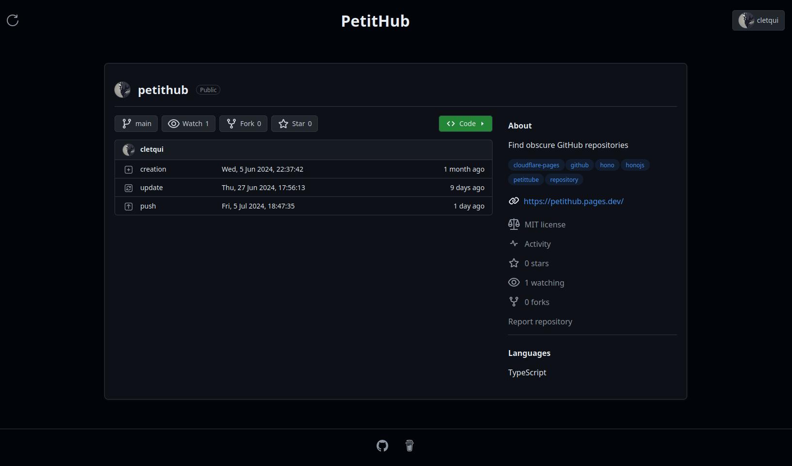

# PetitHub 🌌

Explore the hidden gems of GitHub with [PetitHub](https://github.com/cletqui/petithub/)!

This project is an adaptation of the [Petit Tube](https://en.wikipedia.org/wiki/Petit_Tube) concept to GitHub: it allows users to discover random, obscure GitHub repositories that have no stars. Whether you're looking to find an undiscovered masterpiece or just satisfy your curiosity, PetitHub is here to take you on a journey through the lesser-known corners of GitHub.



## Links 🔗

- Cloudflare: [petithub.pages.dev](https://petithub.pages.dev/)
- GItHub: (coming soon) ⏳
  [](https://github.com/cletqui/petithub/actions/workflows/pages/pages-build-deployment)

## Table of Contents 📋

- [PetitHub 🌌](#petithub-)
  - [Links 🔗](#links-)
  - [Table of Contents 📋](#table-of-contents-)
  - [Features ✨](#features-)
  - [How It Works 🔍](#how-it-works-)
  - [Endpoints 📑](#endpoints-)
    - [Main Page](#main-page)
    - [Custom API](#custom-api)
  - [Getting Started 🚀](#getting-started-)
    - [Prerequisites](#prerequisites)
    - [Installation](#installation)
    - [Using the App](#using-the-app)
  - [Authentication 🔐](#authentication-)
  - [Technologies Used 🛠️](#technologies-used-️)
  - [Contributing 🤝](#contributing-)
  - [License 📄](#license-)
  - [Contact 📧](#contact-)
  - [Acknowledgements 🙏](#acknowledgements-)
  - [Support ☕](#support-)
  - [Roadmap 🗺️](#roadmap-️)
    - [TODO](#todo)
    - [Done](#done)

## Features ✨

- 🎲 **Random Repository Discovery**: Explore random GitHub repositories that have zero stars.
- 🎨 **Custom Repository Display**: View repository information (name, author, language, stars, watchers, forks...) in a fully integrated custom display.
- 🔗 **Quick Access**: Easily navigate to the GitHub page of any displayed repository.
- 👤 **Enhanced Browsing with Authentication**: Connect your GitHub account to remove rate limits and access additional features like starring repositories.
- 🔧 **Custom API**: Search for niche repositories by name or ID using the integrated API.
- 🚀 **Fast and Fun Interface**: Built with the [Hono](https://hono.dev/) framework for a smooth and enjoyable user experience.

## How It Works 🔍

PetitHub uses the Octokit package to interact with the GitHub API. It browses the public repositories looking for unique, not starred repositories. You can use the app without a GitHub account, but signing in with [GitHub App](https://github.com/apps/cletqui-petithub) provides a more seamless experience without rate limiting and unlocks extra features.

PetitHub is built with [Hono](https://hono.dev/) over a Vite server for a fast user and easy developer experience. It fully integrates most of the features from Hono.

## Endpoints 📑

### Main Page

The main page displays a random GitHub repository with all its relevant details. You can quickly star the repository or visit its GitHub page.

### Custom API

- **Browse by Name or ID**: Look up repositories by their name or ID using our custom API endpoints.
- **Recent Repository ID**: Retrieve the ID of the most recently created repository on GitHub.

## Getting Started 🚀

### Prerequisites

- Node.js
- npm

### Installation

1. Clone the repository:

   ```sh
   git clone https://github.com/cletqui/petithub.git
   cd petithub
   ```

2. Install dependencies:

   ```sh
   npm install
   ```

3. Start the development server:

   ```sh
   npm run dev
   ```

### Using the App

Open your browser and navigate to `http://localhost:5173` to start exploring obscure GitHub repositories.

## Authentication 🔐

For an enhanced experience, connect your GitHub account. This will allow you to bypass rate limits and access special features like starring repositories directly from PetitHub.

## Technologies Used 🛠️

- **Hono JS Framework**: For a fast and clean frontend experience.
- **Octokit**: To interact with the GitHub API.
- **Node.js**: Backend runtime environment.
- **Vite**: Server framework.

## Contributing 🤝

Contributions are welcome! Feel free to open an issue or submit a pull request.

1. Fork the repository.
2. Create your feature branch:

   ```sh
   git checkout -b feature/AmazingFeature
   ```

3. Commit your changes:

   ```sh
   git commit -m 'Add some AmazingFeature'
   ```

4. Push to the branch:

   ```sh
   git push origin feature/AmazingFeature
   ```

5. Open a pull request.

## License 📄

Distributed under the MIT License. See `LICENSE` for more information.

## Contact 📧

X / Twitter - [@cletqui](https://twitter.com/cletqui)

Project Link: [https://github.com/cletqui/petithub](https://github.com/cletqui/petithub)

## Acknowledgements 🙏

- Inspired by Petit Tube.
- Thanks to the developers of Octokit and Hono JS.

## Support ☕

If you like this project, you can support me by buying my next coffee on [BuyMeACoffee](https://www.buymeacoffee.com/cletqui).

Happy exploring! 🌟

---

## Roadmap 🗺️

### TODO

- [ ] Improve GUI
  - [x] add additional info about the repo
  - [x] implement dark/light themes
  - [x] mimic GitHub layout
  - [x] set page title as `full_name` & use GitHub link in header like GitHub page
  - [x] cache svg imports
  - [x] add reload button
  - [x] fix header hidden on small screens
  - [ ] add colors for languages
  - [ ] refactor code wit [shadcn](https://ui.shadcn.com/) UI
  - [x] fix cookie storage/deletion (and interferences with GUI)
  - [x] change the document title dynamically (with nested `Suspense`)
  - [x] use nested renderer to render multiple components
  - [x] use `useRequestContext` to have conditional render
  - [ ] implement Swagger with API
  - [x] add profile name + icon when connected + fix UI
  - [x] add possibility to logout
  - [ ] allow starring repo when connected
- [ ] Handle Octokit errors (401 & 403)
- [ ] Define unit tests
- [x] Fix interfaces and type definitions
- [ ] Setup GitHub Actions
  - [ ] to deploy the website to GitHub
  - [x] to run tests automatically
  - [x] fix GitHub security detection on `tests` files
- [ ] Make sure the project is compatible with multiple deployment types
  - [x] Cloudflare
  - [ ] GitHub
  - [ ] Heroku
- [ ] Refactor saving `access_token` in c.var and access it through `octokit.auth` instead
- [ ] Sanitize all strings into `${string}`

### Done

- [x] Write `README.md`
- [x] Write GitHub App description
- [x] fix API by adding 404 not found if no repo by id is found
- [x] Add icons in footer
- [x] Find `MAX_ID` dynamically and store in Cookies
- [x] Require GitHub API (Bearer Auth) for `/api/*` requests
- [x] Display Template
- [x] Refactor code into smaller modules
- [x] Setup GitHub App
  - [x] fix oauth workflow
  - [x] define default demo/GitHub choice page
  - [x] error handling when `access_token` is not defined (go back to authentication or use default token)
  - [x] validate the token used before using them
  - [x] fix `access_token`/`refresh_token` cookie storage issue
  - [x] optimize performance
  - [x] change GitHub App icon
  - [x] handle `state` verification
  - [x] handle `access_token` refresh with `refresh_token`
- [x] Use middlewares
  - [x] to declare the octokit instance
  - [x] to add auth header if access_token is valid (to allow API use when `access_token` is defined)
