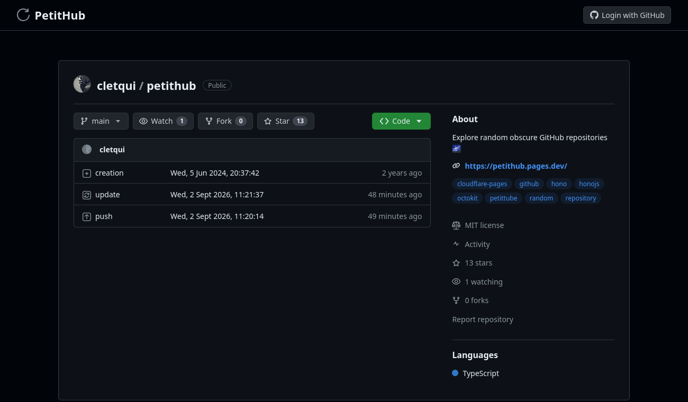

# PetitHub 🌌

Explore the hidden gems of GitHub with [PetitHub](https://petithub.pages.dev/)!

PetitHub adapts the [Petit Tube](https://en.wikipedia.org/wiki/Petit_Tube) concept to
GitHub: it shows you a random, obscure public repository that has **zero stars**. Reload
for another one.



## Features ✨

- 🎲 **Random discovery** – a fresh zero-star repository on every reload.
- 🎨 **GitHub-style display** – repository details rendered in a familiar layout.
- 👤 **Sign in to keep browsing** – anonymous requests share GitHub's
  unauthenticated rate limit (60/hour). Connect your GitHub account via the
  [PetitHub GitHub App](https://github.com/apps/cletqui-petithub) to browse with your
  own token instead.
- 🔧 **JSON API** – `GET /api` for a random repository, `GET /api/{id}` for a specific one
  (Bearer token required). Interactive docs at `/api/swagger`.

## How it works 🔍

PetitHub is a [Hono](https://hono.dev/) app rendered server-side (streaming JSX, no client
hydration) and deployed on **Cloudflare Pages**. It talks to the GitHub REST API through
[Octokit](https://github.com/octokit): it samples a random offset into the public
repository list and inspects a few candidates until it finds one with no stars, that isn't
a fork, and isn't empty. Requests use your OAuth token when you are signed in, otherwise
the shared anonymous limit applies.

## Development 🚀

Requires [Bun](https://bun.sh/).

```sh
git clone https://github.com/cletqui/petithub.git
cd petithub
bun install
cp .dev.vars.example .dev.vars   # fill in the values you have
bun run dev                      # http://localhost:5173
```

Scripts: `bun run dev`, `bun run build`, `bun run typecheck`, `bun run preview`
(wrangler), `bun run deploy`.

### Environment

| Variable        | Purpose                        |
| --------------- | ------------------------------ |
| `CLIENT_ID`     | GitHub App OAuth client id     |
| `CLIENT_SECRET` | GitHub App OAuth client secret |

Both are needed for the GitHub sign-in flow; without them PetitHub still runs in
anonymous mode. Locally they live in `.dev.vars`; in production they are Cloudflare
Pages secrets.

## Contributing 🤝

Issues and pull requests welcome. `bun run typecheck` and `bun run build` must pass (CI
runs both).

## License 📄

MIT — see [`LICENSE`](LICENSE).

## Acknowledgements 🙏

Inspired by Petit Tube. Built with [Hono](https://hono.dev/) and
[Octokit](https://github.com/octokit).

If you enjoy it, you can [buy me a coffee](https://www.buymeacoffee.com/cletqui) ☕
